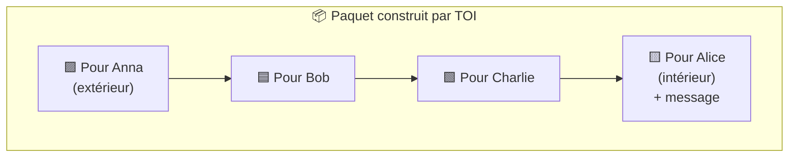
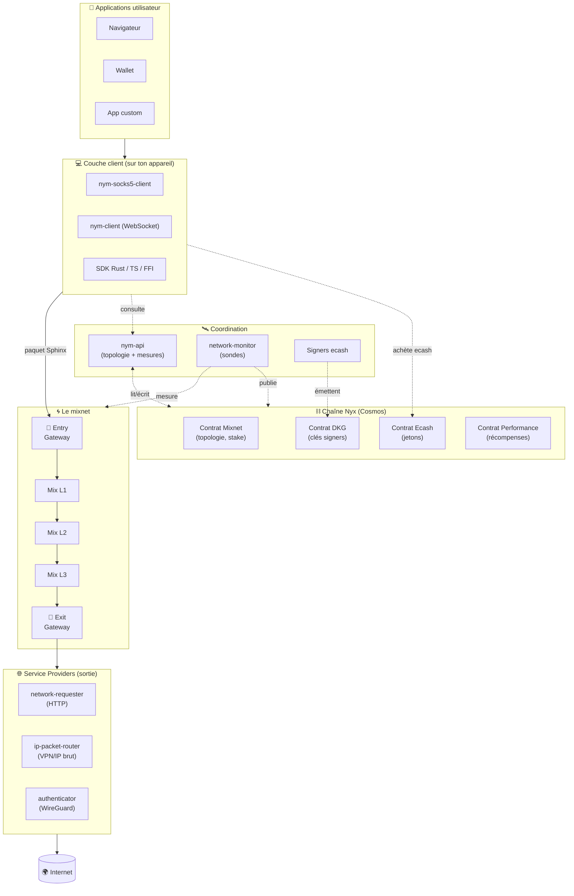
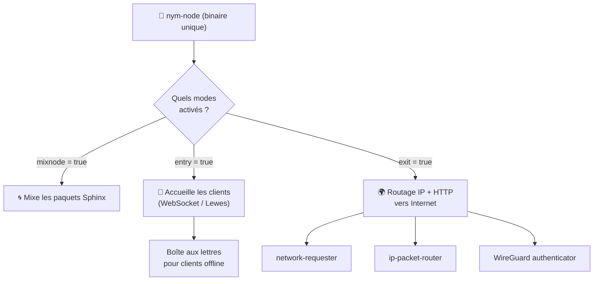
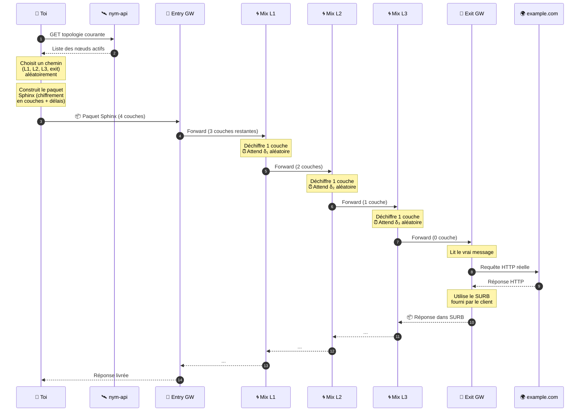
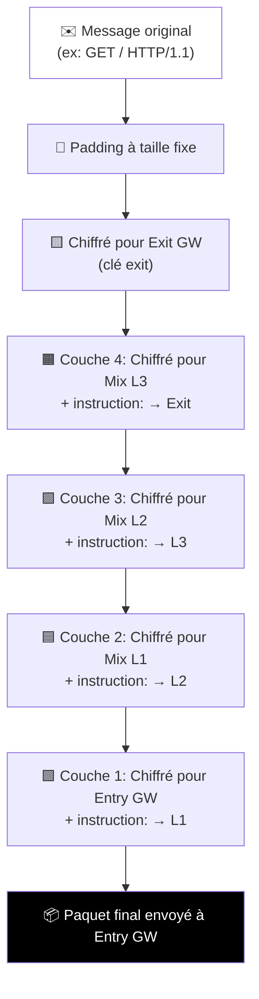
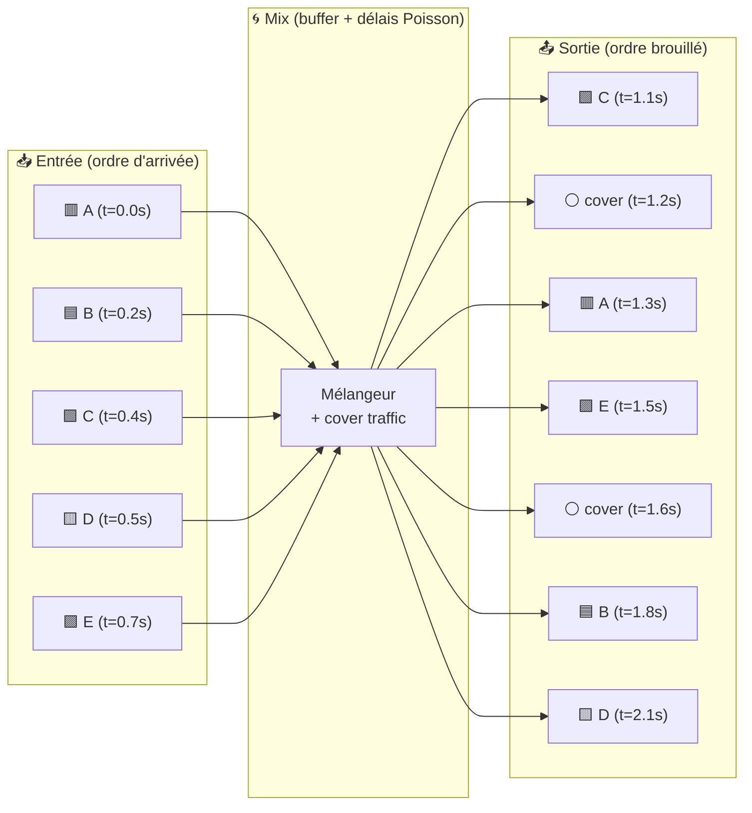
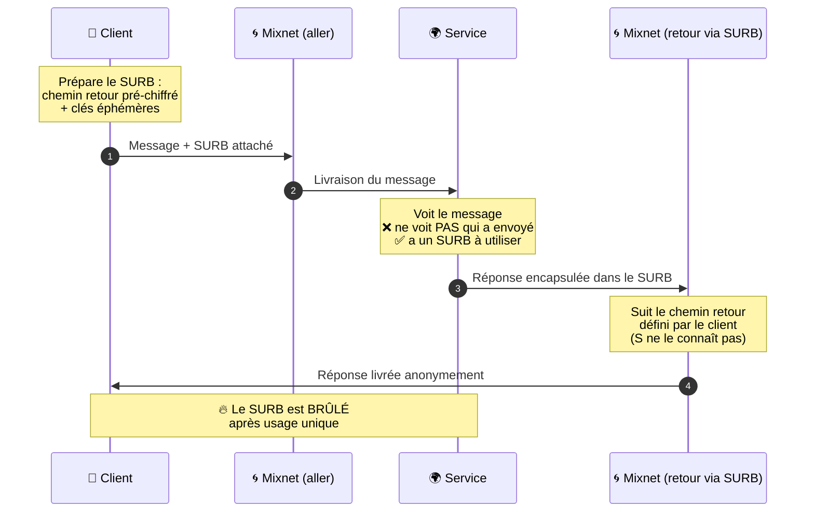
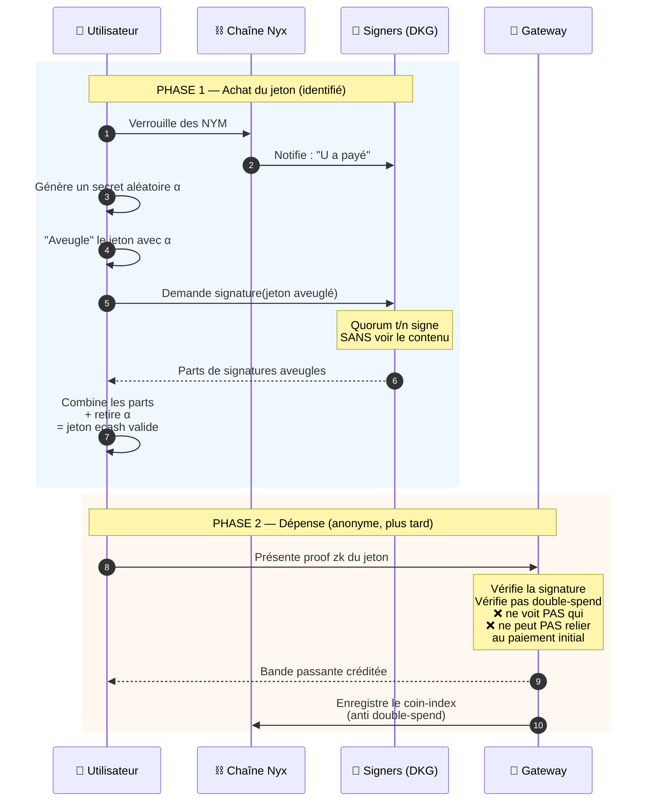
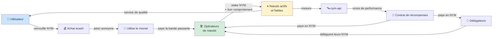

# Le mixnet Nym, expliqué simplement

> Un guide pour comprendre ce qu'est Nym et comment il fonctionne, sans prérequis technique.
> Les sections deviennent progressivement plus détaillées : tu peux t'arrêter quand tu en sais assez.

---

## Table des matières

1. [À quoi sert Nym ?](#1-à-quoi-sert-nym-)
2. [Une analogie pour commencer](#2-une-analogie-pour-commencer)
3. [Vue d'ensemble du système](#3-vue-densemble-du-système)
4. [Les acteurs du réseau](#4-les-acteurs-du-réseau)
5. [Le voyage d'un message, étape par étape](#5-le-voyage-dun-message-étape-par-étape)
6. [Pourquoi mélanger les paquets ne suffit pas (et la solution)](#6-pourquoi-mélanger-les-paquets-ne-suffit-pas-et-la-solution)
7. [Recevoir une réponse sans donner son adresse (les SURBs)](#7-recevoir-une-réponse-sans-donner-son-adresse-les-surbs)
8. [Payer le réseau de façon anonyme (l'ecash)](#8-payer-le-réseau-de-façon-anonyme-lecash)
9. [Qui fait tourner Nym, et pourquoi ?](#9-qui-fait-tourner-nym-et-pourquoi-)
10. [Tor, VPN, Nym : quelle différence ?](#10-tor-vpn-nym--quelle-différence-)
11. [Les limites et les compromis](#11-les-limites-et-les-compromis)
12. [Pour aller plus loin dans le code](#12-pour-aller-plus-loin-dans-le-code)
13. [Glossaire](#13-glossaire)

---

## 1. À quoi sert Nym ?

Quand tu envoies un message, un email, ou que tu visites un site web, ton trafic transite par
beaucoup d'intermédiaires (ton FAI, des routeurs, des serveurs). Même si le **contenu** est
chiffré (HTTPS, Signal, etc.), il reste des **métadonnées** visibles :

- **qui** parle à **qui**,
- **quand**,
- **à quelle fréquence**,
- **combien d'octets**.

Ces métadonnées sont souvent plus révélatrices que le contenu. Savoir que tu as appelé un numéro
de SOS suicide à 3h du matin pendant 40 minutes est plus parlant que le contenu de la conversation.

**Nym est un réseau qui cache les métadonnées de communication.** Même un adversaire qui voit
*tout* le trafic du monde ne doit pas pouvoir dire que **toi** tu parles à **telle personne** ou
**tel service**.

---

## 2. Une analogie pour commencer

Imagine que tu veux envoyer une lettre à Alice sans que personne ne sache que c'est toi qui l'a
envoyée.

**Première idée naïve** : tu mets la lettre dans une enveloppe avec ton adresse au dos. Mauvais
plan : le facteur sait tout.

**Deuxième idée** : tu enveloppes la lettre dans **trois enveloppes**.
- L'enveloppe la plus interne est adressée à Alice.
- Tu la mets dans une enveloppe adressée à **Charlie**.
- Tu mets le tout dans une enveloppe adressée à **Bob**.
- Tu mets le tout dans une enveloppe adressée à **Anna**.

Tu envoies à Anna. Anna ouvre son enveloppe, voit "à transmettre à Bob", envoie à Bob. Bob
ouvre, voit "à transmettre à Charlie", envoie à Charlie. Charlie ouvre, voit "à transmettre à
Alice", envoie à Alice.

- **Anna sait** : c'est toi qui as envoyé un truc à Bob. Elle ne sait pas pour qui c'est au final.
- **Bob sait** : il a reçu d'Anna, doit envoyer à Charlie. Il ne sait ni l'expéditeur d'origine,
  ni le destinataire final.
- **Charlie sait** : il a reçu de Bob, doit envoyer à Alice. Il ne sait pas qui a envoyé.
- **Alice sait** : elle reçoit de Charlie. Elle ne sait pas qui est l'expéditeur d'origine.

Aucun intermédiaire seul ne connaît la paire (expéditeur, destinataire). C'est le principe de
**l'oignon** : plusieurs couches, chacune retirée par un intermédiaire différent.

**Nym fait exactement ça, mais en numérique, automatiquement, et avec des protections en plus.**
Le format de paquet utilisé s'appelle **Sphinx**. C'est un cousin de ce que fait Tor, en mieux
sur certains aspects (taille fixe, retards, trafic de couverture — on y vient).

### Visualisons l'oignon



À chaque hop, **une seule couche est retirée**. L'intermédiaire ne voit que sa couche et le blob
restant, opaque.

---

## 3. Vue d'ensemble du système

Avant d'entrer dans le détail, voici la carte globale de **toutes** les pièces qui composent Nym :



Tu n'as pas besoin de tout comprendre tout de suite : les sections suivantes zooment sur chaque
zone.

---

## 4. Les acteurs du réseau

```
   TOI                                                              le SITE
   (client) ──► [Entry] ──► mix ──► mix ──► mix ──► [Exit] ──► Internet
                Gateway     L1       L2      L3      Gateway
                            ════════════════════════
                                  le "mixnet"
```

### Le client
C'est le logiciel sur ton appareil qui parle à Nym. Dans le code, c'est
`clients/native` (générique) ou `clients/socks5` (pour brancher des apps existantes comme
Firefox via un proxy SOCKS5). Il y a aussi des SDKs (Rust, TypeScript, FFI) sous `sdk/`.

### La passerelle d'entrée (entry gateway)
Le premier nœud avec qui ton client parle. Elle voit ton adresse IP réelle, mais elle ne sait
**pas ce que tu envoies ni à qui** (tout est chiffré en couches). Elle sert aussi de **boîte aux
lettres** : si tu es hors-ligne, elle garde tes messages pour toi.

### Les mix (mixnodes)
Les nœuds du milieu. Ils sont organisés en **couches** (typiquement 3 couches). Un paquet passe
par un mix de la couche 1, puis un de la couche 2, puis un de la couche 3. Chaque mix :
- **enlève une couche de chiffrement** (comme une enveloppe),
- **attend un délai aléatoire** (très important, on explique pourquoi plus loin),
- **transmet** au mix suivant.

### La passerelle de sortie (exit gateway)
Le dernier nœud avant Internet. Elle "ouvre" le paquet final et fait la vraie requête HTTP, ou
route le paquet IP, selon ce que tu fais. Elle voit le site final que tu visites, mais
**pas qui tu es**.

### Les service providers
Des composants spécialisés intégrés aux exit gateways :
- **network-requester** : exécute des requêtes HTTP "classiques" vers Internet.
- **ip-packet-router** : route des paquets IP bruts (mode VPN-like).
- **authenticator** : enregistre les pairs WireGuard pour le mode VPN.

### Les "validateurs" et le contrat
En arrière-plan, une blockchain Cosmos (la chaîne **Nyx**) tient à jour :
- la liste des nœuds disponibles,
- qui a le droit d'opérer un nœud (mise de tokens),
- comment les récompenses sont calculées.

C'est l'épine dorsale économique qui fait que des inconnus prennent la peine de faire tourner
les nœuds.

### L'API du réseau (nym-api)
Un service qui interroge la chaîne, mesure la performance des nœuds, et **publie la topologie
courante** aux clients. C'est là que ton client va chercher "qui sont les mixnodes actifs aujourd'hui".

### Le binaire universel : `nym-node`
Dans le code (`nym-node/`), tout est en réalité **le même programme**. Quand tu lances
`nym-node`, tu actives un ou plusieurs modes (`mixnode`, `entry`, `exit`). Le code de dispatch
est dans `nym-node/src/node/mod.rs`.



Les modes ne sont pas exclusifs : un opérateur peut activer plusieurs rôles sur la même machine.

---

## 5. Le voyage d'un message, étape par étape

Tu veux envoyer un message à un service (mettons, une requête HTTP vers `example.com`).

### Vue séquentielle complète



### Étape 1 — Préparation (sur ton appareil)

Ton client Nym :
1. Demande à `nym-api` la liste actuelle des nœuds.
2. **Choisit aléatoirement** un mix dans chaque couche (L1, L2, L3) et une exit gateway.
3. Calcule les **clés partagées éphémères** avec chacun de ces nœuds (cryptographie ECDH).
4. Construit le paquet **Sphinx** : il enveloppe le message en commençant par la couche la plus
   interne (pour la exit) et en remontant.



Chaque hop **ne peut déchiffrer que sa propre couche** — il découvre uniquement la prochaine
destination et un blob opaque à transmettre.

5. Choisit pour chaque hop un **délai aléatoire** (tiré d'une loi de Poisson).
6. Découpe en **paquets de taille fixe**. Si ton message est trop gros, plusieurs paquets ; trop
   petit, du padding. Tous les paquets Sphinx ont **la même taille sur le réseau**.

### Étape 2 — Envoi à la entry gateway

Ton client envoie le paquet à sa entry gateway via WebSocket (transport classique) ou via le
**Lewes Protocol** (transport TCP plus rapide, voir `docs/LP_PROTOCOL.md`). La gateway voit ton
IP, mais elle reçoit un blob de taille fixe qu'elle ne peut pas déchiffrer au-delà de la première
couche.

### Étape 3 — Premier mix (couche 1)

Le mix L1 reçoit, déchiffre **sa** couche, découvre :
- la prochaine destination (un mix L2),
- un délai d'attente,
- le reste du paquet, toujours chiffré.

Il attend ce délai, puis envoie. Pendant ce délai, **plein d'autres paquets sont entrés et
sortis** du mix. Si quelqu'un observait l'entrée et la sortie du mix, il serait incapable de
dire quel paquet sortant correspond à quel paquet entrant.

### Étape 4 — Couches 2 et 3

Pareil. Chaque mix retire une enveloppe, attend, transmet.

### Étape 5 — La exit gateway

Le dernier mix livre à la exit gateway. La exit ouvre la dernière enveloppe et y trouve le
**vrai message** : une requête HTTP, un paquet IP, etc. Elle exécute la requête vers Internet.

### Étape 6 — Le retour

La réponse doit revenir à toi. Mais ton client **n'a jamais donné son adresse** dans le message.
Comment fait-on ? Avec les **SURBs**, section suivante.

---

## 5. Pourquoi mélanger les paquets ne suffit pas (et la solution)

L'idée naïve : "il suffit que les nœuds mélangent les paquets, et hop, anonyme". En vrai, un
adversaire qui voit **tout le réseau** peut faire de l'**analyse de trafic** :

> "Tiens, 18h32 et 4 secondes, Alice envoie un paquet de 1247 octets à la gateway G.
> 18h32 et 11 secondes, la exit E envoie un paquet de 1247 octets à `example.com`.
> Probable que ce soit le même."

Pour casser ça, Nym combine **trois défenses** :

### (a) Taille fixe
Tous les paquets Sphinx font la même taille. On ne peut pas relier "Alice a envoyé 1247 octets"
à "la exit a envoyé 1247 octets" parce que tout fait pareil.

### (b) Délais aléatoires
Chaque mix attend un temps aléatoire avant de relayer. Au sortir d'un mix qui a 100 paquets en
buffer, l'ordre des paquets n'a plus rien à voir avec l'ordre d'arrivée. C'est **ça**, le vrai
"mix" — pas juste relayer.

### (c) Trafic de couverture (cover traffic)
Même quand tu n'as rien à dire, ton client envoie des **paquets bidons**, indistinguables des
vrais. Les mix génèrent aussi du trafic factice. Résultat : un adversaire qui observe ne peut
même pas dire **quand** tu communiques. Le simple fait d'être connecté ne révèle rien.

Le code de ces paquets est dans `common/nymsphinx/cover/`.

### Le mixing visualisé

Imagine un seul mixnode qui reçoit des paquets dans un certain ordre et les ressort
**dans un ordre différent** après des délais variables :



Un observateur ne peut pas dire "le 3ème paquet sortant correspond au 3ème paquet entrant" :
- l'ordre change,
- des paquets de cover sont injectés,
- tous les paquets ont la même taille.

---

## 7. Recevoir une réponse sans donner son adresse (les SURBs)

Tu veux qu'`example.com` te réponde. Si tu mets ton adresse dans le message, la exit gateway la
voit, et toute la peine pour cacher l'expéditeur est gâchée.

**Solution : le SURB** (*Single-Use Reply Block*).

Un SURB, c'est un **paquet Sphinx pré-construit** que **toi** tu prépares à l'avance, avec un
chemin de retour de ton choix. Tu le donnes au destinataire avec ton message. Le destinataire
peut écrire sa réponse "dedans" et la lâcher dans le réseau, **sans savoir** quel chemin elle va
prendre ni qui est le destinataire final.

Analogie : une enveloppe pré-timbrée pré-adressée à une boîte postale anonyme à toi. La personne
qui répond met juste la réponse dedans et la jette à la boîte aux lettres. Elle ne sait pas où
la boîte postale est physiquement.

Caractéristique importante : **un SURB ne sert qu'une fois** (sinon on pourrait corréler deux
utilisations). Pour de longues conversations, on envoie plein de SURBs d'avance.

Le code est dans `common/nymsphinx/anonymous-replies/`.

### Le flow d'un SURB



Le service qui répond **ne sait pas** :
- où le SURB l'emmène,
- quel chemin physique sera utilisé,
- qui est le destinataire final.

Il ne peut qu'utiliser ou jeter le SURB.

---

## 8. Payer le réseau de façon anonyme (l'ecash)

Un mixnet coûte cher à faire tourner (bande passante, électricité, machines). Les opérateurs
ont besoin d'être payés. Mais si tu payes avec ta carte bancaire ou même un wallet crypto
classique, **on peut te relier à ton trafic** : le réseau voit que c'est *toi* qui paye, donc
*toi* qui utilise tel slot de bande passante.

**Solution : l'ecash anonyme.**

L'ecash, c'est une forme d'argent numérique inventée par David Chaum dans les années 80. L'idée :

1. Tu vas voir une banque (ici, un groupe de **signers**), tu déposes des tokens, et tu reçois
   en échange une **signature aveugle** sur un jeton.
2. "Aveugle" veut dire : la banque a signé, mais elle n'a **pas vu** ce qu'elle signait — comme
   signer une enveloppe en papier carbone. Tu obtiens un jeton signé, mais la banque ne pourra
   pas reconnaître ce jeton plus tard.
3. Tu présentes ce jeton à la gateway. Elle vérifie la signature, l'accepte, te crédite de la
   bande passante. Elle ne peut **pas** te relier au paiement original.

Nym utilise une version moderne et améliorée : **compact ecash distribué**, sur la courbe
elliptique BLS12-381 (`common/nym_offline_compact_ecash/`).

**"Distribué"** : aucun signer unique n'a la clé. C'est un **DKG** (*Distributed Key Generation*,
dans `common/dkg/` et le contrat `contracts/coconut-dkg/`) : *n* signers génèrent ensemble une
clé, et il faut un quorum *t* d'entre eux pour signer un jeton. Personne ne peut frauder seul.

**"Compact"** : un jeton peut représenter plusieurs unités de bande passante et être dépensé
petit à petit, sans révéler combien il en restait.

**"Offline"** : la vérification ne nécessite pas que les signers soient en ligne au moment de
la dépense.

Le contrat on-chain qui orchestre tout ça est `contracts/ecash/`.

### Le flow ecash, étape par étape



**Le point magique** : entre la phase 1 et la phase 2, le secret α casse le lien. Les signers
ont signé "quelque chose", mais ils ne savent pas quoi. Au moment où le jeton apparaît à la
gateway, personne ne peut faire le lien avec l'utilisateur qui a payé.

---

## 9. Qui fait tourner Nym, et pourquoi ?

### Les opérateurs de nœud
Des personnes ou des entreprises qui déploient une machine et la mettent en mode `nym-node`.
Pour entrer dans la topologie active, elles doivent **miser** (staker) des tokens NYM, ce qui
les engage à se bien comporter (si elles trichent, elles perdent leur mise).

### Les délégateurs
Si tu n'as pas envie de gérer un serveur mais que tu veux soutenir un nœud, tu peux **déléguer**
tes NYM à un opérateur. Tu partages ses récompenses, en échange du risque qu'il soit mal noté.

### Les récompenses
À chaque "époque" (intervalle de temps régulier), le contrat `contracts/mixnet/` distribue des
récompenses :
- aux opérateurs, en fonction de leur **performance** (mesurée par `nym-network-monitor` et
  publiée par `nym-api`),
- aux délégateurs, en proportion de leur délégation,
- aux signers ecash, pour leur rôle d'émission.

Performance = combien de paquets de test ont été correctement relayés. Un nœud qui plante ou
triche voit ses récompenses chuter.

### Les validateurs Nyx
La chaîne Cosmos sous-jacente est sécurisée par des validateurs classiques (Proof of Stake), qui
n'ont rien à voir avec les opérateurs de nœuds mixnet. Ils valident les blocs et exécutent les
smart contracts.

### En résumé : un cercle économique



Le système est en **équilibre incitatif** : opérateurs honnêtes → bonnes mesures → bonnes
récompenses → reste honnête. Opérateur qui triche → mauvaises mesures → perd ses récompenses
voire son stake → se fait éjecter.

---

## 10. Tor, VPN, Nym : quelle différence ?

| Aspect | VPN | Tor | Nym |
|---|---|---|---|
| Cache l'IP au destinataire | ✅ | ✅ | ✅ |
| Cache la destination au FAI | ✅ | ✅ | ✅ |
| Plusieurs sauts | ❌ (1 seul) | ✅ (3) | ✅ (3+) |
| Délais aléatoires | ❌ | ❌ | ✅ |
| Trafic de couverture | ❌ | ❌ | ✅ |
| Taille de paquet uniforme | ❌ | partielle | ✅ |
| Résiste à un observateur global | ❌ | ❌ | ✅ (objectif) |
| Latence | très faible | faible | plus élevée |
| Modèle économique | abonnement | bénévolat | incitations crypto |

**TL;DR** :
- **VPN** : un seul intermédiaire que tu dois croire sur parole. Rapide.
- **Tor** : trois intermédiaires, plus de garanties, mais vulnérable à un adversaire qui observe
  l'entrée **et** la sortie en même temps (analyse de timing).
- **Nym** : conçu *spécifiquement* contre l'adversaire qui voit tout, au prix d'une latence
  supérieure. Idéal pour la messagerie, les paiements, les requêtes API où quelques secondes de
  délai sont acceptables.

---

## 11. Les limites et les compromis

Nym n'est pas magique. Honnêtement :

- **Latence** : les délais aléatoires et le mixing ajoutent du temps. Streaming vidéo ? Pas
  idéal. Messagerie, requêtes API, transactions ? Très bien.
- **Anonymat ≠ secret du contenu** : le **contenu** envoyé à un service est vu par ce service.
  Si tu te connectes à ton compte Gmail via Nym, Gmail sait que c'est toi. Nym cache que **ton
  FAI** sait que tu parles à Gmail, pas que Gmail te connaît.
- **Anonymat de groupe** : tu es anonyme dans une **foule**. Plus il y a d'utilisateurs simultanés,
  plus tu es caché. Avec très peu de monde, l'anonymat se dégrade.
- **Attaques par corrélation à long terme** : si tu envoies toujours des paquets à 03h42 et 12
  secondes pendant 6 mois, des statistiques peuvent finir par te démasquer. Mitigation : cover
  traffic, padding.
- **Confiance dans le code et la cryptographie** : il faut faire confiance à l'implémentation
  Rust. Heureusement, c'est open source — n'importe qui peut lire et auditer.
- **Le Lewes Protocol révèle l'IP du client au gateway**. C'est un compromis assumé : on échange
  une partie de l'anonymat au niveau réseau contre de la vitesse et de la fiabilité au
  enregistrement. Tu choisis quand tu l'utilises.

---

## 12. Pour aller plus loin dans le code

Si tu veux ouvrir le capot, voilà les points d'entrée par sujet :

| Tu veux comprendre… | Va voir |
|---|---|
| Le format de paquet Sphinx | `common/nymsphinx/src/` |
| Les SURBs | `common/nymsphinx/anonymous-replies/` |
| Le trafic de couverture | `common/nymsphinx/cover/` |
| Comment un mix relaye | `common/nymsphinx/forwarding/` |
| L'ecash anonyme | `common/nym_offline_compact_ecash/` |
| Le DKG (génération de clé distribuée) | `common/dkg/` |
| Le protocole client ↔ gateway (WebSocket) | `common/gateway-requests/`, `common/client-libs/gateway-client/` |
| Le Lewes Protocol (TCP rapide) | `common/nym-lp/` + `docs/LP_*.md` |
| Le binaire nym-node et ses modes | `nym-node/src/node/mod.rs` |
| La sortie HTTP vers Internet | `service-providers/network-requester/` |
| Le routage IP (VPN-like) | `service-providers/ip-packet-router/` |
| Les smart contracts | `contracts/{mixnet,ecash,coconut-dkg,...}/` |
| La topologie et le monitoring | `nym-api/src/` |
| Les SDKs | `sdk/rust/`, `sdk/typescript/`, `sdk/ffi/` |

---

## 13. Glossaire

- **Anonymat** : impossible pour un observateur de relier une action à une identité.
- **Cover traffic (trafic de couverture)** : paquets factices envoyés en permanence pour cacher
  les vrais paquets dans la masse.
- **DKG (Distributed Key Generation)** : protocole où *n* parties créent ensemble une clé sans
  que personne ne la voie en entier ; il faut un quorum *t* pour signer.
- **Ecash** : monnaie numérique qui permet de payer sans être identifié, grâce aux signatures
  aveugles.
- **Entry gateway** : premier nœud du mixnet, point d'entrée du client.
- **Exit gateway** : dernier nœud, point de sortie vers Internet.
- **Lewes Protocol (LP)** : protocole TCP rapide pour l'enregistrement client ↔ gateway, basé
  sur Noise et KKT (post-quantique hybride).
- **Métadonnées** : informations *sur* une communication (qui, quand, combien) plutôt que son
  contenu.
- **Mix / mixnode** : nœud du milieu qui retire une couche de chiffrement, attend, et relaye.
- **Mixnet** : un réseau composé de plusieurs mix en couches.
- **Nyx** : la blockchain Cosmos sur laquelle Nym déploie ses smart contracts.
- **NYM** : le token utilisé pour staker, payer, récompenser.
- **Onion routing** : chiffrement en couches, chaque hop retire une couche.
- **SOCKS5** : un protocole standard de proxy ; Nym peut s'utiliser comme proxy SOCKS5 local.
- **Sphinx** : le format de paquet à taille fixe utilisé par Nym (et d'autres mixnets).
- **SURB** : *Single-Use Reply Block*, un paquet de retour pré-construit pour recevoir une
  réponse sans révéler son adresse.
- **Topologie** : la liste des nœuds actifs et leur organisation en couches à un instant donné.
- **WireGuard** : un protocole VPN moderne ; Nym l'utilise pour le mode VPN à pleine bande
  passante.

---

*Ce document est une introduction. Pour les détails cryptographiques et les preuves de sécurité,
voir le [whitepaper Nym](https://nymtech.net/nym-whitepaper.pdf) et les documents `LP_*.md` dans
ce dossier.*
